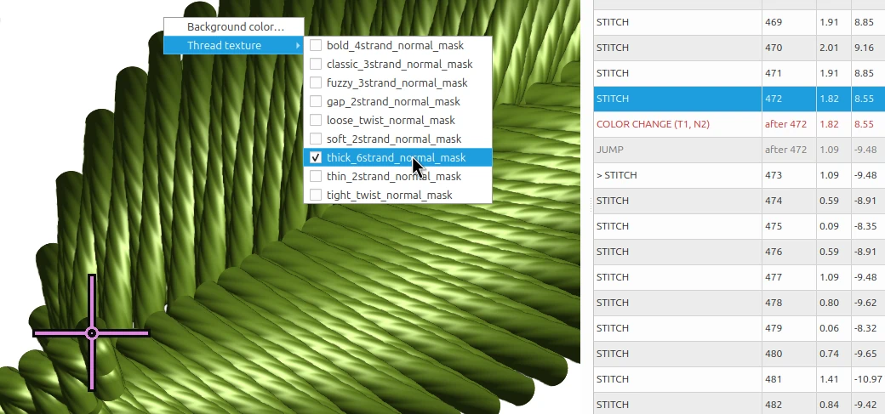

# InkSim

InkSim is a standalone interactive embroidery simulator and preview renderer.
It opens embroidery files, displays their stitch sequence, and lets the user
inspect or replay the design before production.

<p align="center">
  
</p>

The viewer now includes an **OpenGL textured renderer** that draws stitches as
realistic ribbon quads with normal-mapped thread and Blinn-Phong lighting. Press
`Z` in the viewer to toggle between the CPU and GPU renderers. The GPU renderer
requires **OpenGL 3.3**; older systems and virtual machines fall back to the
CPU raster renderer automatically.

<p align="center">
  
  <br>
  <em>Detail of the normal-mapped thread texture used by the OpenGL renderer.</em>
</p>

InkSim is experimental software provided for development and testing.

## Running

Run InkSim from your terminal or command prompt:

```bash
inksim design.pes
```

On Windows you can also use `inksim-gui design.pes` to launch without a console
window. Both command names work the same on Windows, macOS, and Linux.

## Installation

InkSim requires Python 3.11 or newer. Install it with your preferred Python
package manager (`uv`, `pip`, `pipx`, or another). See the
[installation guide](docs/installation.md) for step-by-step instructions for
the most common tools, including how to add InkSim to your `PATH` and how to
install a development copy from source.

## Quick start

```bash
inksim
inksim design.pes
inksim design.pes --play
```

## Documentation

- [Installation and running](docs/installation.md)
- [User guide](docs/user-guide.md)
- [Application interconnect](docs/interconnect.md)
- [Contributing](CONTRIBUTING.md)

## Background

The idea behind this tool dates back to 2013 with an experimental C++/Qt project
called Orca, which originally explored graph algorithms for Inkscape on Linux
before turning into a digitizer and stitch viewer. Here is an old recording of
that early prototype in action:

[Orca viewer demo](https://www.youtube.com/watch?v=VKle5ApsMnA)

**InkSim** is a fresh, standalone rewrite of that viewer concept -- built from
scratch using Python, PySide6, and Numba. The main goal is to provide a fast,
lightweight way to preview embroidery files without heavy overhead.

It was built to fill a small workflow gap, and it's shared with the hope that
others in the Inkscape and Ink/Stitch community might find it helpful as well.

Special thanks to the Ink/Stitch team and community for keeping open-source
embroidery alive and inspiring.

## License

InkSim is released under the [GNU General Public License v3 or later](LICENSE).
