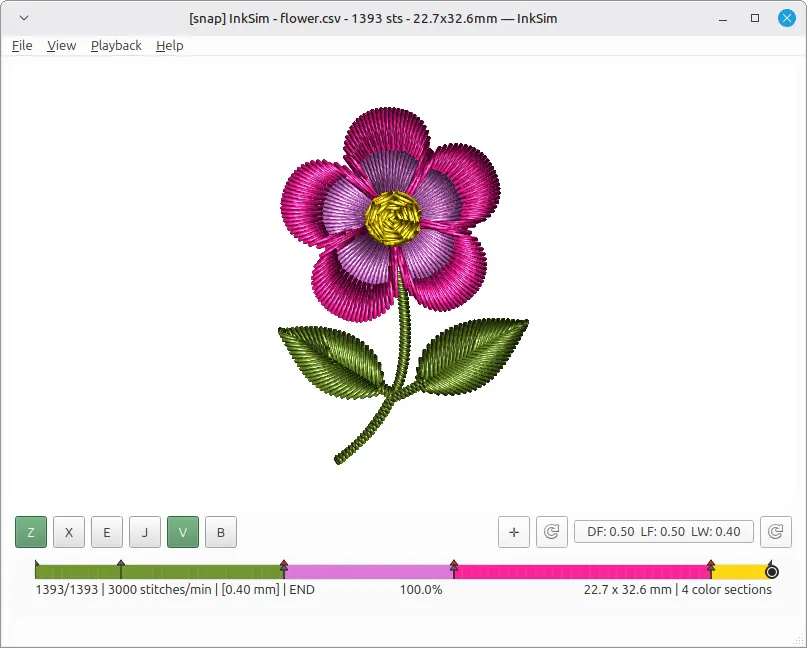

# InkSim

InkSim is a standalone embroidery simulator and preview renderer. It opens
embroidery files, shows the stitch sequence, and lets you inspect or replay a
design before production.

It is a normal Python desktop application installed from PyPI — **not** an
Inkscape extension.

<p align="center">
  
</p>

## Install

```bash
uv tool install inksim
```

Requires Python 3.11+. See the [installation guide](docs/installation.md) for
`uv` setup and alternative installers.

## Run

```bash
inksim
inksim design.pes
inksim design.pes --play
```

On Windows, `inksim-gui design.pes` starts without a console window.

<p align="center">
  
</p>

## Documentation

- [Installation and running](docs/installation.md)
- [User guide](docs/user-guide.md)
- [Rendering modes and overlays](docs/rendering.md)
- [Inkscape / Ink/Stitch workflow](docs/inkscape-workflow.md)
- [Application interconnect](docs/interconnect.md)
- [Contributing](CONTRIBUTING.md)

## Background

The idea behind this tool dates back to 2013 with an experimental C++/Qt project
called Orca, which originally explored graph algorithms for Inkscape on Linux
before turning into a digitizer and stitch viewer. Here is an old recording of
that early prototype in action:

[Orca viewer demo](https://www.youtube.com/watch?v=VKle5ApsMnA)

**InkSim** is a fresh, standalone rewrite of that viewer concept -- built from
scratch using Python, PySide6, and Numba. The main goal is to provide a fast,
lightweight way to preview embroidery files without heavy overhead.

It was built to fill a small workflow gap, and it's shared with the hope that
others in the Inkscape and Ink/Stitch community might find it helpful as well.

Special thanks to the Ink/Stitch team and community for keeping open-source
embroidery alive and inspiring.

## License

InkSim is released under the [GNU General Public License v3 or later](LICENSE).
