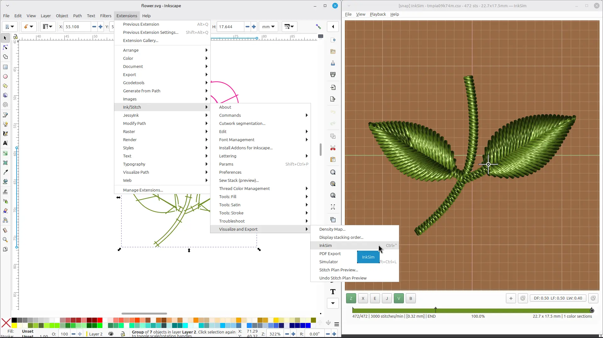
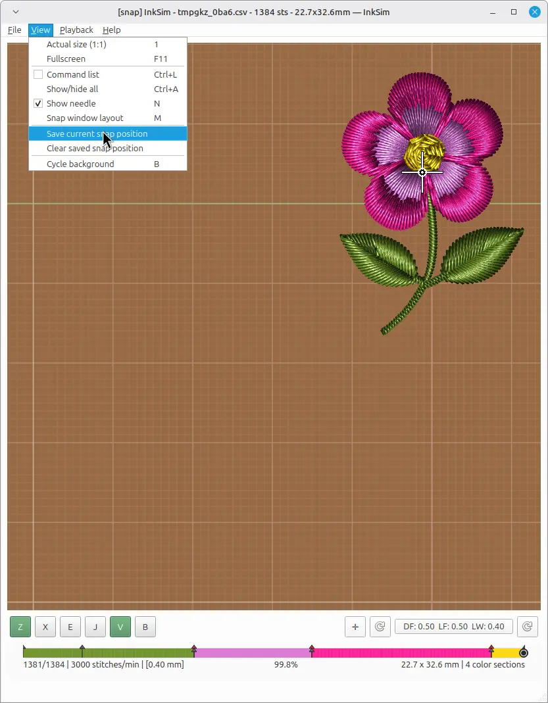
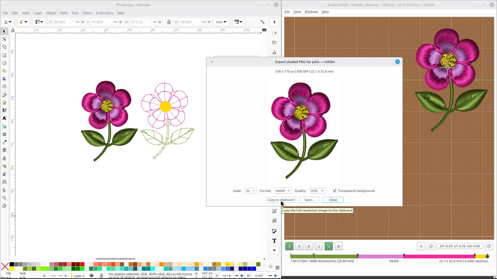

# Inkscape / Ink/Stitch / InkSim workflow

InkSim works as an external preview for the [Ink/Stitch](https://inkstitch.org/) extension. Design and edit the embroidery inside Inkscape, then send it to InkSim with one click or shortcut.

> **Preliminary integration.** The Ink/Stitch extension menu shown below is not part of the official Ink/Stitch release yet. It currently exists as a proposal / branch implementation and would need to go through a PR before becoming available to all users.

## Calling InkSim from Inkscape

Select the objects you want to preview and choose:

**Extensions → Ink/Stitch → Visualize and Export → InkSim**

or press **Ctrl+"**.

Ink/Stitch builds a stitch plan and forwards it to InkSim. The extension uses a small local IPC command, so InkSim can run in its own window independently of Inkscape.

## Window layout and snap position

When you work with Inkscape on one side and InkSim on the other, use **View → Save current snap position** to remember the InkSim window position and size. The next time Ink/Stitch opens InkSim, the window snaps back to that layout.

You can also toggle the layout quickly with **View → Snap window layout** (**M**) or clear the saved position from the same menu.

## Export preview back to Inkscape

After inspecting the design, copy the rendered preview back to Inkscape:

1. Choose **File → Export shaded PNG for print**.
2. Click **Copy to clipboard**.
3. Switch to Inkscape and press **Ctrl+V** to paste the image next to your vector design.

The pasted image is the full-resolution preview, so it keeps the same quality as the saved PNG.

## Tips

- Press **R**, **X**, **J**, **N**, **G**, **E**, **Z**, etc. to switch renderers and overlays.
- The **bottom view** (**E**) shows how the back of the embroidery would look.
