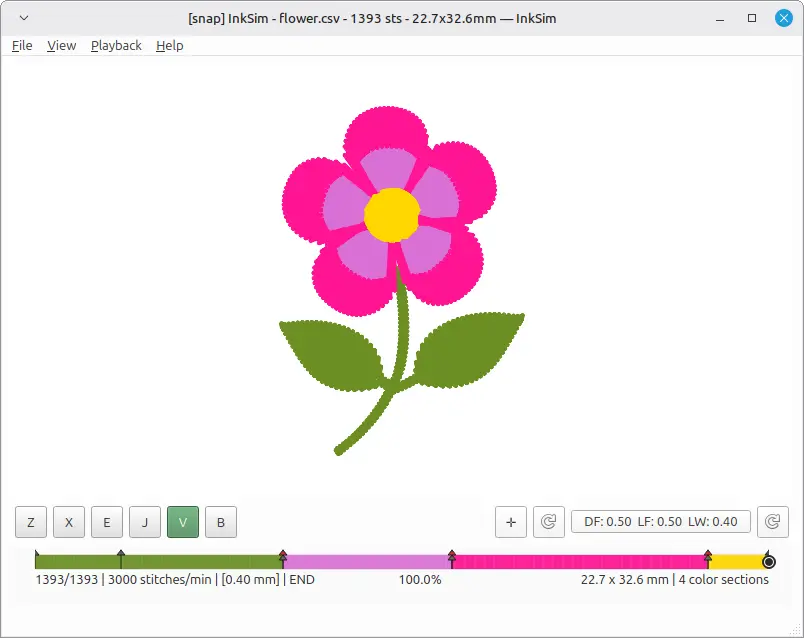
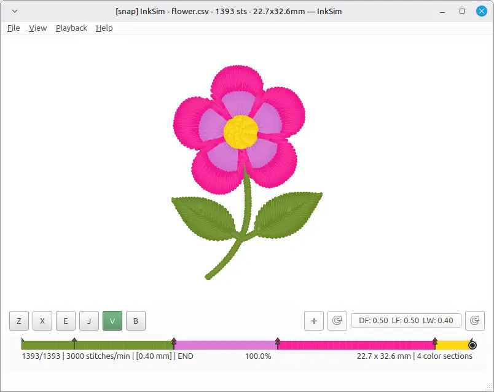
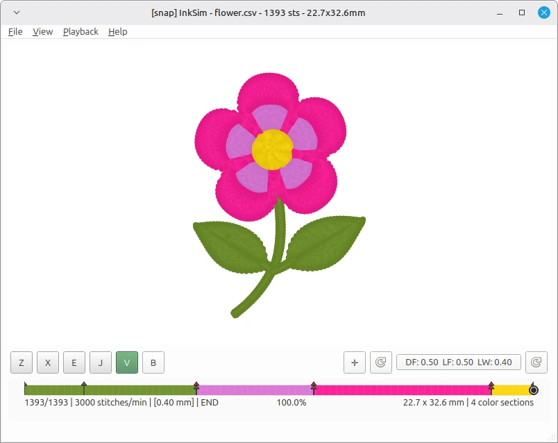
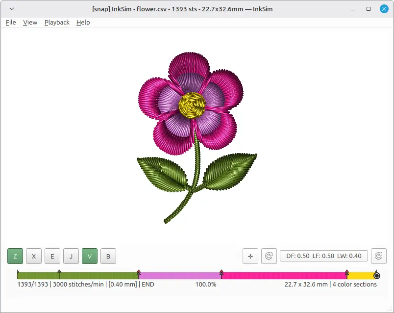
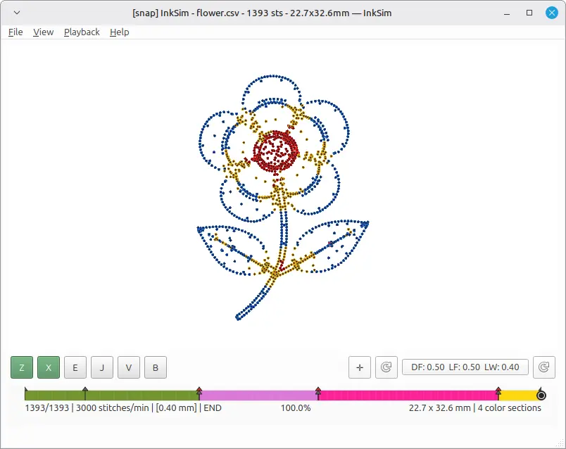
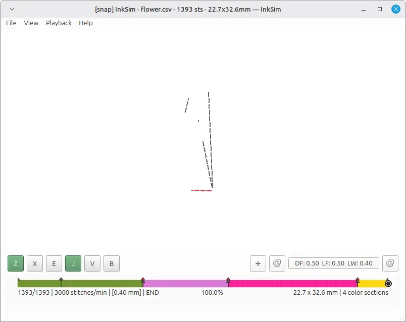
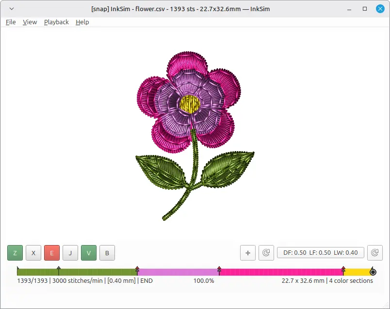

# Rendering modes and overlays

InkSim can visualise the same embroidery design in several different ways.
The goal is the same in every mode: show the stitch sequence, thread
colours, and jumps clearly. Some modes are fast, others are more realistic,
and a few are specialised overlays for checking the design before production.

Switch renderers with the **R** key, or pick one from the **File → Renderer**
menu. Toggle overlays with the single-letter shortcuts shown below.

---

## Stitch renderers

### Simple

The fastest renderer. Each stitch is drawn as a thin line. Use it for very
large designs or slow machines.

### Shaded

A CPU raster renderer that draws stitches with simple directional shading.
Faster than the volume renderers but still gives a sense of thread direction.

### Shaded Volume

The default CPU renderer. Stitches are drawn as small shaded volumes, so the
design looks like a stack of stitches rather than flat lines.

### Shaded Volume Natural

A variant of Shaded Volume with more natural-looking lighting. Good for
screenshots and previews that should look close to real thread.

### Realistic Twist

Adds a twist-like texture to each stitch. Useful when you want to see how the
thread might look under side lighting.

### GPU Textured

The most realistic renderer. Draws each stitch as a normal-mapped ribbon quad
with Blinn-Phong lighting. Requires **OpenGL 3.3**; InkSim falls back to a CPU
renderer automatically if the GPU renderer is not available.

---

## Overlays and helpers

Overlays do not change the stitch renderer; they add extra information on top
of it.

| Key   | Overlay          | Purpose                                                        |
| ----- | ---------------- | -------------------------------------------------------------- |
| **X** | Density map      | Highlights areas with too many stitches per square mm          |
| **J** | Jumps            | Shows jump stitches and trims                                  |
| **N** | Needle crosshair | Shows the current needle position and direction                |
| **G** | Measurement grid | Adds a millimetre / centimetre grid behind the design          |
| **E** | Bottom view      | Draws later stitches under earlier ones, as seen from the back |

### Density map

The density map highlights places where stitches are packed too tightly.
Dark red areas should be reviewed before production.

### Jumps

Jump stitches are shown as thin connecting lines. Press **J** repeatedly to
cycle through _off_, _all jumps_, and _risky jumps only_.

### Needle crosshair

The needle overlay marks the current stitch position with a crosshair and an
outlined circle. It is especially helpful during playback.

### Measurement grid

The grid shows millimetre, centimetre, and major 5 cm lines, plus the X and Y
axes. It is drawn behind the stitches and is useful for checking real-world
sizes.

### Bottom view

Bottom view reverses the draw order so later stitches appear _under_ earlier
ones. It simulates looking at the embroidery from the back side of the fabric.

---

## Tips

- Press **Z** to toggle the GPU textured renderer quickly.
- Press **1** to see the design at its physical size for the current display.
- Use **+** / **−** to zoom in and out.
- Combine renderers and overlays freely: for example, use Shaded Volume with
  the density overlay to review both appearance and stitch density at once.
