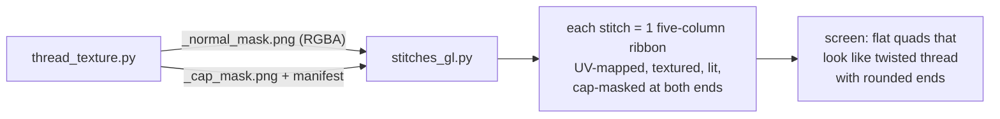
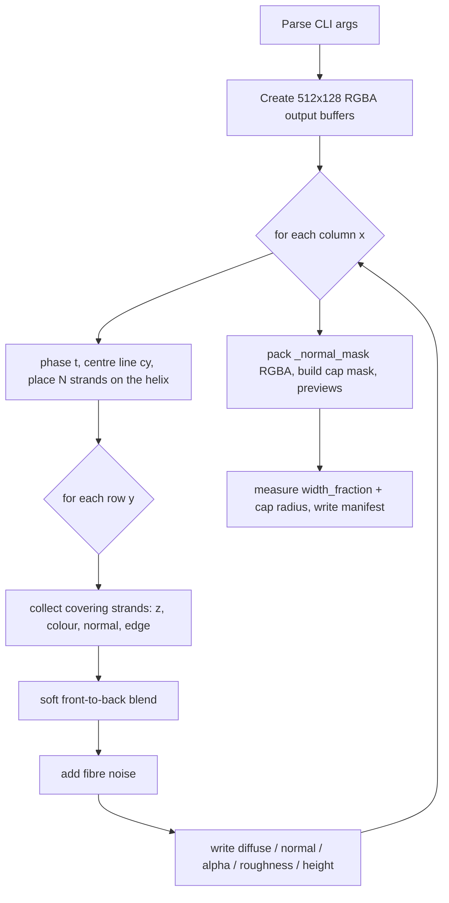

# How `thread_texture.py` works — a ground-up explanation

This document explains `thread_texture.py` for someone who has never worked with
PBR textures, normal maps, or UV mapping before. It explains **what the script
does, in which units it thinks, and why** every stage exists.

---

## 1. Why does this script exist at all?

The GPU renderer (`src/inksim/render/stitches_gl.py`) draws every stitch as a
**flat, rectangular quad** (a "ribbon"). A flat rectangle cannot look like a
round, twisted embroidery thread out of the box — real thread is a bundle of
thin strands twisting around each other, with bright ridges and dark valleys.

Modelling real 3D geometry for every stitch (thousands per pattern) would be
far too slow. Instead we **fake the 3-D look with a texture**:



The texture is a _tile_: a small picture of a piece of thread seen from the
side, exactly one (or three) full twist(s) long. The renderer stretches this
tile along each stitch, repeated as many times as the stitch is long. Because
the tile's left and right edges match, the repetition is invisible — like
wallpaper.

So the script's job is: **paint that tile**, once, offline, so the renderer can
copy it cheaply at runtime.

---

## 2. The concepts (for absolute beginners)

### 2.1 Texture maps

A modern renderer does not use "a picture" but several _maps_ — greyscale or
colour images that each carry one physical property:

| Map                  | What it means in plain words                                      | Used by the live renderer?                                     |
| -------------------- | ----------------------------------------------------------------- | -------------------------------------------------------------- |
| **diffuse / albedo** | The base colour of the surface with baked-in lighting             | No (the app colours stitches with the pattern's thread colour) |
| **normal map**       | Fake bumps: each pixel stores "which way the surface points here" | **Yes — this is where all the shading comes from**             |
| **alpha mask**       | Which pixels are thread and which are empty background            | **Yes** — empty pixels are cut out, neighbours show through    |
| **roughness**        | How matte vs. shiny a surface point is                            | No (reserved for a future PBR renderer)                        |
| **height**           | How high the surface bulges (for displacement)                    | No                                                             |

The only file the app ships is `_normal_mask.png` — the normal map (RGB) and
the alpha mask (A) packed into one RGBA image. That is why the generator
produces it specially.

### 2.2 Normal maps, in one paragraph

A normal map stores, per pixel, a **surface direction** — the direction the
surface "faces" at that point — encoded as a colour:

```
stored_rgb = (normal + 1) / 2        # i.e. normal * 0.5 + 0.5
```

- `R ≈ 0.5` → no tilt along the thread,
- `G ≈ 0.5` → no tilt across the thread,
- `B` large (bright blue) → surface pointing _out of the screen_ (the usual base state).

At runtime the shader decodes the direction, and classic diffuse + specular
lighting math uses it. A pixel on the ridge of a strand "faces" the light →
bright; a pixel in the valley faces away → dark. This makes a **flat quad
behave as if it were bumpy**, at zero geometric cost.

### 2.3 Alpha mask

Embroidery thread is not a solid ribbon: between the twisted strands there are
air gaps. The alpha mask is white (opaque) where a strand covers the pixel,
black (transparent) where there is a gap. The runtime shader simply discards
pixels whose alpha is below a threshold (`texel.a < 0.01`), so neighbouring
stitches remain visible through the gaps — that is what sells the "loose
twisted threads" look.

### 2.4 UV mapping

UV coordinates tell the shader _which pixel of the texture_ to look up for
every point of the geometry:

- **U** runs along the stitch (horizontally on the texture). It is chosen to
  **wrap/repeat** — U values larger than 1 simply restart from the tile's
  beginning. That is how one small tile dresses a stitch of any length.
- **V** runs across the thread (vertically on the texture), `0` at the ribbon's
  upper edge, `1` at the lower edge. V is clamped (no repetition), so one
  ribbon width shows exactly one copy of the cross-section.

`twist_periods = 3` means: the tile you see contains 3 complete 360° twists.
One full twist occupies `512 / 3 ≈ 171 px` of the tile.

---

## 3. The thread model used by the generator

The script does not draw a picture by hand — it **simulates the thread's
cross-section mathematically** and photographs it with lighting math.

### 3.1 Coordinate system (all numbers are _texture pixels_)

| Axis | Meaning in the generator                                                             |
| ---- | ------------------------------------------------------------------------------------ |
| `x`  | along the thread (texture U) — the loop variable, 0 … width−1                        |
| `y`  | across the thread — down the texture (0 … height−1, `height/2` = thread axis)        |
| `z`  | toward the viewer (out of the screen) — used only for depth sorting & the fake bulge |

Nothing here is millimetres or screen pixels. It is a self-contained 512×128
canvas; **only ratios matter** (see §5).

### 3.2 The helix — where the strands are

For every column `x` we compute the twist phase:

```
t = 2π · x / period          (period = width / twist_periods, in px)
```

The thread's centre line wiggles slightly:

```
cy = height/2 + amp · sin(t)               (amp = 2 px — barely visible)
```

Each of the `num_strands` strands then rotates around that centre line like a
screw. Strand `i` sits at:

```
angle_i = t + 2π·i/num_strands + twist_offset
y_i = cy + helix_radius · sin(angle_i)     (up/down position: creates the X weave)
z_i = helix_radius · cos(angle_i)          (front/back: which strand is on top)
```

So as you move along `x`, every strand oscillates up and down while also
rotating to the front and back of the bundle — exactly how a twisted thread
looks in cross-section. Because the phase advances by full multiples of 2π
over one `period`, the tile repeats seamlessly in U.

```
 V (across thread)
 128 px ┌────────────────────────────────────────────┐
        │      ●  strand going up                    │        ● = strand centre,
        │                                            │            circle radius = strand_radius
        │  axis ──────────────────────────────       │
        │                                ● going down│
        └────────────────────────────────────────────┘
         U (along the thread): 512 px = 3 full twists
```

### 3.3 Per-pixel: who covers this pixel?

For every pixel row `yi` in the column:

1. For each strand: `dy = yi − y_i`. If `|dy| > strand_radius` the strand does
   not reach this pixel — skip.
2. Otherwise the strand's round cross-section means the visible surface bulges
   toward the camera:

    ```
    dz = sqrt(strand_radius² − dy²)
    z_surface = z_i + dz
    ```

    (A chord/Pythagoras relation: the centre of the chord sits `dz` closer to
    the camera than the strand axis — that is literally "half a cylinder".)

3. The surface normal of that cylinder is `(0, dy/r, dz/r)`: tilted across the
   thread (ny) and pointing outward (nz = the bulge).
4. A small **torsion nudge** is added so the weave shows highlights moving
   diagonally, as real crossed strands do:

    ```
    twist_factor = helix_radius / (2 · strand_radius)      -- ≈ 0.23
    Δx = −sin(angle) · twist_factor · 0.3                  -- tilt along the thread
    Δy =  cos(angle) · twist_factor · 0.3                  -- extra across tilt
    ```

### 3.4 Baked lighting (preview maps only)

With the fixed light direction `L = (0.3, −0.6, 0.7)` (from upper-left,
pointing out of the screen) the generator applies classic Blinn–Phong:

- diffuse `0.4 + 0.6 · max(N·L, 0.1)` — the 0.4 floor keeps shadows readable,
- specular `max(N·H, 0)^40 · 0.8` — a small, tight glossy dot on ridges,
- the base colour rises from `color_bottom` → `color_mid` → `color_top`
  depending on the normal's across-tilt (valleys dark, ridges bright).

**Important:** this baked colour lands only in `_diffuse/_rgba` preview images.
The _live renderer ignores it_ and instead lights the normal map dynamically —
that is why thread colour can follow the pattern at runtime.

### 3.5 Overlapping strands and soft blending

Several strands can cover the same pixel. The generator:

1. Sorts all covering strands front-to-back (`z_surface`),
2. Gives the front strand weight 1 and the ones behind exponentially smaller
   weights: `exp(−depth / blend_softness)` — `blend_softness` (px, default 2.5)
   controls how sharply the front strand "occludes" the ones behind,
3. Multiplies each weight by the pixel's edge anti-aliasing factor `edge^0.7`,
4. Averages colours/normals by weight, takes the maximum `edge` for alpha.

The result: smooth, believable cross-overs instead of hard cut-out stacks.

### 3.6 Fibre noise

Thread is fuzzier than a perfect cylinder, so deterministic noise (fixed seed
`42`) is Gaussian-smoothed and added to colour (and slightly to normals).
`fiber_noise = 0.06` by default; the `fuzzy_3strand` variant raises it to
`0.14`.

---

## 4. Output files

| File                       | Contents                             | Consumer                     |
| -------------------------- | ------------------------------------ | ---------------------------- |
| `<prefix>_diffuse.png`     | RGB, baked colour (for eyeballing)   | humans only                  |
| `<prefix>_normal.png`      | RGB normal map, no alpha             | humans / future use          |
| `<prefix>_mask.png`        | 8-bit alpha mask                     | humans / future use          |
| `<prefix>_normal_mask.png` | RGBA = normal RGB + mask alpha       | **the app (packaged asset)** |
| `<prefix>_cap_mask.png`    | 8-bit semicircle end-cap mask        | **the app (packaged asset)** |
| `<prefix>_roughness.png`   | roughness values 0.05–0.8            | future PBR                   |
| `<prefix>_height.png`      | relative bulge height                | future displacement          |
| `<prefix>_rgba.png`        | baked colour preview on transparency | humans                       |
| `<prefix>_manifest.json`   | parameters + measured fractions      | the renderer                 |

The normal map is stored in OpenGL convention `(n · 0.5 + 0.5)`. The runtime
shader _decodes_ it by subtracting 0.5 — the two must match exactly.

`scripts/texture/generate_variants.sh` runs the generator for all named styles
and copies every `<variant>_normal_mask.png`, `<variant>_cap_mask.png` and
manifest into `src/inksim/assets/thread_textures/`.

---

## 5. Units — what does `strand_radius: float = 24.0` mean?

**Every geometry parameter in this script is measured in pixels of the texture
canvas** — a canvas that is 512 px long (`U`, along the thread) and 128 px tall
(`V`, across the thread) by default. Not millimetres, not screen pixels, not
stitch units.

At runtime the renderer stretches this canvas so that:

- its **V extent (128 px)** lands exactly on the ribbon width of the stitch,
- its **U extent (512 px)** is repeated every `thread_texture_aspect · ribbon
height` along the stitch (`thread_texture_aspect = 8.0` in the renderers).

Therefore `strand_radius = 24.0` means: _one strand's cross-section is a circle
of radius 24 px, i.e. `24/128 = 18.75 %` of the canvas height — 18.75 % of the
ribbon width_. Only these **fractions** survive to runtime; if you multiplied
every pixel parameter by 2 and doubled `width`/`height` too, the texture would
come out identical.

The bundle half-width on the canvas is ≈ `helix_radius + strand_radius`
(= 35 px for the defaults), so the thread covers ≈ 70/128 ≈ 55 % of the canvas
height — which is exactly what `width_fraction` measures.

### Parameter reference (defaults in parentheses)

| Parameter                              | Unit                      | Meaning / visual effect                                                                                                                                |
| -------------------------------------- | ------------------------- | ------------------------------------------------------------------------------------------------------------------------------------------------------ |
| `width`                                | px                        | Canvas length along the thread. More px = crisper detail, same physical content.                                                                       |
| `height`                               | px                        | Canvas height across the thread (the "V ruler" every other px value is measured against).                                                              |
| `twist_periods`                        | full 360° twists per tile | Twist density: 3 = one twist per ~171 px; `tight_twist` uses 6, `loose_twist` 1.5. Must round to an integer pixel count to tile seamlessly.            |
| `strand_radius` (24.0)                 | px                        | Thickness of ONE strand. Bigger = chunkier sub-strands and a wider bundle.                                                                             |
| `helix_radius` (11.0)                  | px                        | Distance of strand centres from the thread axis: how strongly strands swing up/down while twisting. Bigger = more pronounced X-weave and wider bundle. |
| `num_strands`                          | count                     | Number of sub-strands in the bundle (2–6 in the shipped variants).                                                                                     |
| `twist_offset`                         | radians                   | Starting phase of the twist (only rotates the pattern; not exposed on the CLI).                                                                        |
| `amp` (2.0)                            | px                        | Amplitude of the small centre-line wiggle. Cosmetic.                                                                                                   |
| `blend_softness`                       | px                        | Softer/larger value → cross-overs blend more softly; small = crisp hard occlusion.                                                                     |
| `fiber_noise`                          | 0–1-ish                   | Amount of micro-fibre fuzz.                                                                                                                            |
| `color_top / mid / bottom / highlight` | RGB 0–255                 | Baked preview palette only — irrelevant to the live renderer.                                                                                          |

### `width_fraction` — the bridge back to physical size

Because every variant fills a different share of the canvas, the generator
measures it:

```
width_fraction = mean over columns of (rows with alpha > 0.05) / canvas height
```

`classic_3strand` → **0.517**: the visible thread occupies ~52 % of the canvas
height. The renderer, which wants a _specific physical_ thread width, divides
its ribbon width by `width_fraction` so the _thread pixels_ (not the whole
canvas incl. empty gaps) come out at the intended size. This is why switching
texture variants does not change the thread's on-screen thickness.

### `cap_mask` and `cap_radius_fraction` — the rounded stitch ends

A real thread does not end in a straight vertical cut: it is trimmed to a
rounded arc. Trimming with geometry (half-disc caps) was tried and rejected;
the working approach is **mask-based trimming**:

1. The generator measures its **own silhouette**: the farthest covered pixel
   row above/below the canvas centre `(height−1)/2` (measured from the alpha
   mask, plus a 1.5 px anti-alias margin) becomes `cap_radius_px`. Every
   variant therefore gets an arc that hugs its own silhouette (helix swing +
   strand thickness + centre wiggle influence it).
2. It paints a **semicircle mask** (`<prefix>_cap_mask.png`, greyscale):
   white = keep, black = trim. The canvas is `ceil(radius)+1` px wide ×
   `height` tall; the **flat side sits on the right edge** (that is where the
   needle point will land) and the arc bulges left, beyond it. One extra fully
   black column sits beyond the arc apex so texture clamping stays clean.
   The mask is centred on `(height−1)/2` — the true pixel-grid middle — so
   the mask is exactly self-symmetric under 180° rotation.
3. The manifest records `cap_radius_px` and `cap_radius_fraction =
cap_radius_px / height` (0.297 for `classic_3strand`) — **how many ribbon
   heights the renderer must extend the stitch past each needle point** so
   the arc can trim the tip.

How the renderer uses it (see §8): each stitch is extended by
`cap_radius_fraction × ribbon_height` beyond both needle points, and the
fragment shader multiplies the thread alpha by the cap mask in those tip
zones, trimming the extension to the rounded arc.

---

## 6. Step-by-step summary of one run



Performance note: this is a plain per-pixel Python loop (`512 × 128 × strands`
inner steps) — it takes seconds and only runs when regenerating assets. It is
deterministic (seed 42), so runs are reproducible.

---

## 7. Usage

```bash
# All variants + copy into the packaged assets (the normal workflow)
cd scripts/texture && ./generate_variants.sh

# One-off experiment
uvr python thread_texture.py --strands 3 --twist-periods 4 \
    --output-dir ./my_textures --prefix my_thread
```

Shipped variants (from `generate_variants.sh`):

| Variant           | Parameters (deviations from defaults)     |
| ----------------- | ----------------------------------------- |
| `classic_3strand` | defaults (`--strands 3`)                  |
| `soft_2strand`    | 2 strands, radius 28, helix 14, blend 3.5 |
| `bold_4strand`    | 4 strands, radius 20, helix 10, blend 2.0 |
| `thin_2strand`    | 2 strands, radius 16, helix 8, blend 2.0  |
| `thick_6strand`   | 6 strands, radius 18, helix 12, blend 1.5 |
| `tight_twist`     | 3 strands, `twist_periods` 6              |
| `loose_twist`     | 3 strands, `twist_periods` 1.5            |
| `fuzzy_3strand`   | 3 strands, `fiber_noise` 0.14             |

To ship a different default, change `DEFAULT_VARIANT` in `generate_variants.sh`
**and** `_default_texture_path()` in `src/inksim/render/stitches_gl.py`
together.

---

---

## 8. How the runtime renderer consumes all this

### 8.1 Ribbon geometry — five columns

`stitches_gl.py` builds each stitch as a **five-column ribbon** (10 vertices,
18 floats per vertex: pos 2, uv 2, tangent 3, bitangent 3, normal 3, color 3,
mask 2, drawn as 24 indices / 8 triangles):

| Column   | Position                                         | Mask mu |
| -------- | ------------------------------------------------ | ------- |
| tip-S    | `start − overshoot` (beyond the needle)          | 0.0     |
| needle-S | the first needle point                           | 0.5     |
| mid      | the stitch midpoint                              | 0.5     |
| needle-E | the second needle point                          | 0.5     |
| tip-E    | `end + overshoot` (beyond the last needle point) | 1.0     |

The ribbon is extended by `cap_radius_fraction × ribbon_height` past both
needle points ("tips"); a real thread continues through the fabric hole, and
the extension is what the cap mask later trims.

### 8.2 U phase — one global twist scale

U advances at **one constant twist density** (tiles per mm) along the FULL
extended length (`needle length + 2 × overshoot`). Tiles chain across
stitches: each stitch starts its U exactly where the previous one ended (the
two tip zones at a shared needle point even sample the same phase window,
like the overlapping physical threads), so short and long stitches look
identical and the twist flows continuously through the needle points. Never
round U spans to whole tiles per stitch — that would give every stitch its
own scale (short stitches would look over-twisted).

### 8.3 The end-cap mask — [as-generated | U-flipped]

The uploaded cap texture is **two copies of the generated semicircle side by
side**:

```
[ original (arc bulges left) | U-flipped (arc bulges right) ]
  start cap, mu 0..0.5         end cap,  mu 0.5..1
```

The seam in the middle joins the two **flat white sides** — a fully white
column that the ribbon body (mu = 0.5) samples, so the body alpha is
untouched. Both tips map `mu = 0.5` (needle) → `0` / `1` (outermost tip),
always with `mv = V` (upper 0, lower 1).

> **Why the flip lives in the texture and not in the vertex data:** mirroring
> `mv` in the end-tip vertices couples `mv` to the along-direction during
> quad interpolation, so the mask gets sampled along a diagonal — the cut
> comes out skewed. Flipping the texture instead keeps each tip's `(mu, mv)`
> interpolation axis-aligned.

The fragment shader then simply does `alpha = texel.a · cap_mask` and
discards below 0.01 — the arc only bites inside the two tip zones. A missing
`_cap_mask.png` falls back to an all-white 1×1 texture (straight-cut ends).

### 8.4 Lighting and colour

- `n = texel.rgb − 0.5` with the along-thread (R) and across-thread (G)
  components scaled by `u_normal_strength_tangent/_bitangent` (the across
  component fades out when zoomed out so distant stitches stay bright),
- Blinn–Phong with runtime light + dark/light factors, tinted with the
  stitch's own colour (the vertex `color` attribute — the texture carries no
  colour).
- Debug modes (live widget): raw texture and raw UV views.

Live view (`gl_viewer.py`) and offscreen rendering (`stitches_gl.py`) build
the same geometry through the shared `_build_satin_quads` and run **mirror-
image shaders + VAO layouts** — the vertex format (18 floats), attribute
layout, `u_cap_mask` binding and double-mask upload must stay in sync in both
files.
